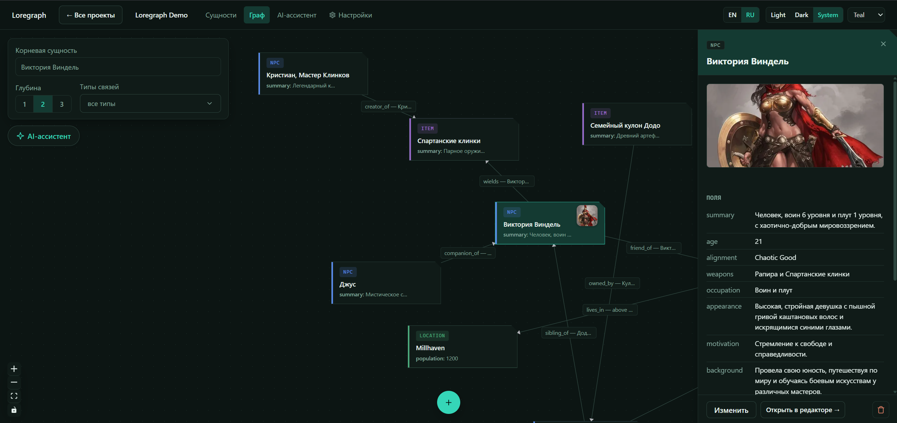
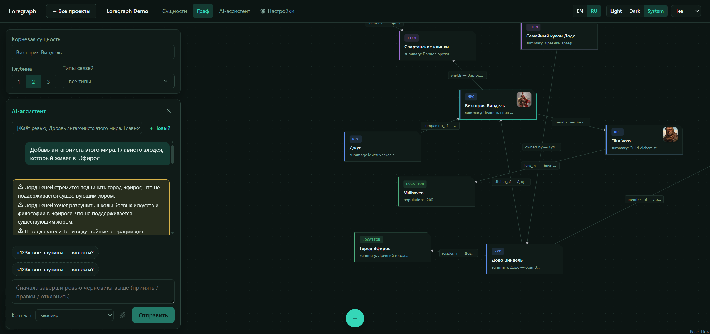
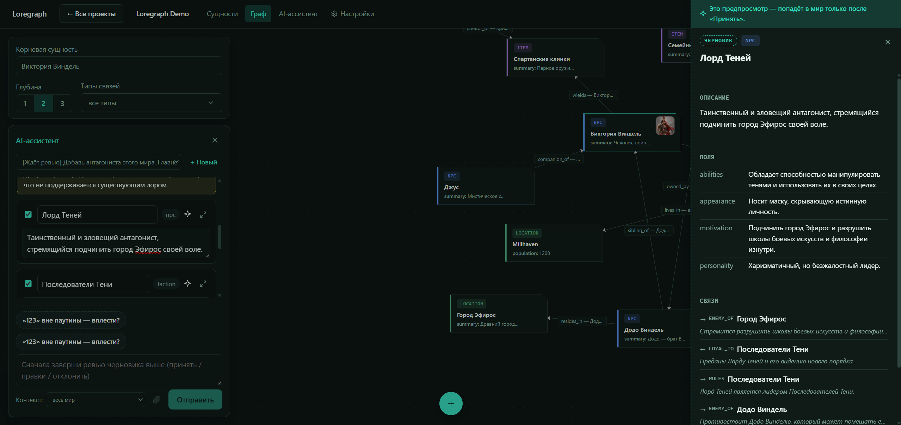
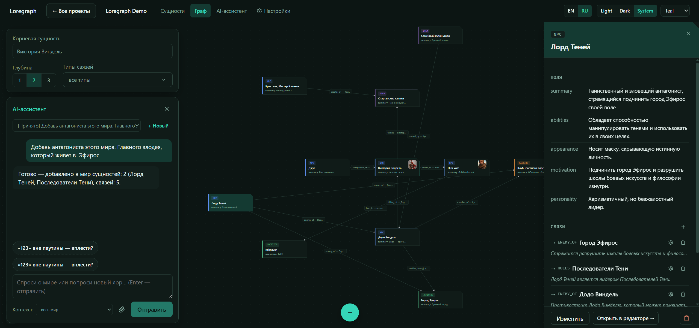
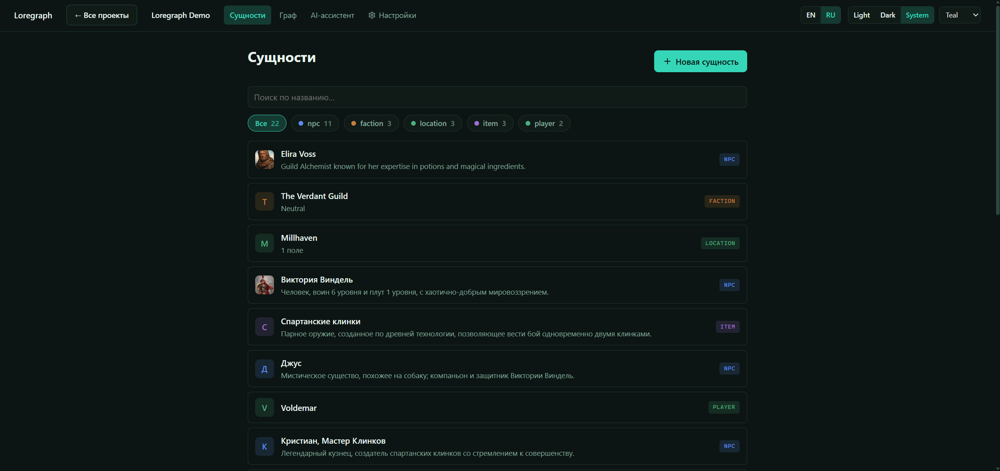
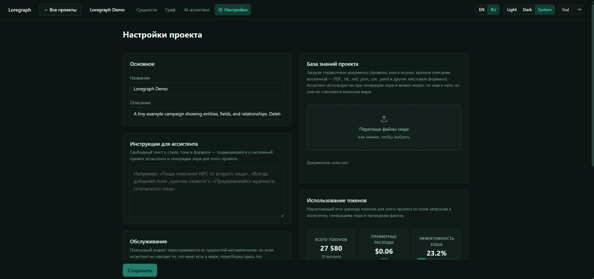

<p align="center">
  
</p>

<h1 align="center">Loregraph</h1>

<p align="center">
  <a href="LICENSE"></a>
  <a href="backend/pyproject.toml"></a>
  <a href="backend/pyproject.toml"></a>
  <a href="frontend/package.json"></a>
  <a href="frontend/package.json"></a>
  <a href="backend/pyproject.toml"></a>
</p>

<p align="center">
  
  
  
  
</p>

<p align="center">
  <a href="https://hadesxgod1337.github.io/loregraph/"></a>
  <a href="https://t.me/loregraph_dev"></a>
  <a href="https://boosty.to/loregraph"></a>
</p>

<p align="center">
  <b><a href="https://hadesxgod1337.github.io/loregraph/">▶ Open the live demo</a></b> — a full in-browser sandbox with a sample campaign.
</p>

> [!IMPORTANT]
> **The AI agent is not free, and Loregraph does not provide it.** Loregraph is
> **BYOK (Bring Your Own Key)**: in a real install you connect **your own** LLM
> API key (Anthropic by default; OpenAI/Ollama optional) and **you pay your LLM
> provider for every token the agent uses**. There is no bundled key, hosted
> model, or subscription from this project.
>
> **The live demo does *not* call any LLM** — nothing is billed. Its AI Assistant
> runs a **pre-scripted** draft → review → commit flow so you can feel the
> human-in-the-loop UX; it does not actually generate content. Demo edits are
> **in-memory and reset on reload**.

<br>

<details>
<summary><h2>Screenshots</h2></summary>
  
  
  
  
  
  
  
</details>

<br>

<details open>
<summary><h2>English</h2></summary>

<p align="center">
  A local, self-hosted app for preparing and running tabletop RPG campaigns —
  entities and relationships in a graph, with an AI agent layer on top.
</p>

## What this is

Loregraph stores your campaign as **entities** (NPCs, factions, locations, items —
anything) connected by a **graph** of typed relationships. You edit it directly, or
the AI agent proposes new entities and relationships grounded in your existing lore
via hybrid retrieval (vector + graph), with a mandatory human-in-the-loop review
gate before anything is written to canon. Foundry VTT and Markdown are export
connectors, not the core of the product.

**Status**: the manual entity/graph editor (v0) and a conversational agent
layer are usable. The AI Assistant is a chat: it answers questions about
your world (grounded in retrieved lore via tools, never from imagination),
asks clarifying questions back, and creates whole pieces of world in one
run — a batch of entities (it picks types and count itself) plus the
relationship web between them and existing lore (LangGraph: assistant loop
with read tools → propose pipeline: hybrid retrieve → duplicate checks →
batch draft → grounding verification → review → commit). Turns stream over
SSE — you see pipeline stages and answer tokens live. Inline batch review
supports approve (with per-entity edits/exclusions), reject, and **request
changes** — iterative revision of the same draft. The assistant lives as a
drawer right in the graph view (an empty world opens it automatically) and
on its own tab. Also: `[[wikilink]]` entity references in rich text, and a
stdio MCP server (`loregraph-mcp`) for external MCP clients. Multi-step session
preparation (orchestrator + parallel workers) and Foundry/Markdown connectors
are planned.

### AI Assistant setup (optional, BYOK)

Create `backend/.env` with `CAMPAIGN_ANTHROPIC_API_KEY=sk-ant-...` (or
`CAMPAIGN_LLM_PROVIDER=openai|ollama` + matching settings, see
`backend/src/loregraph/config.py`). Without a key the manual editor works
fully; the Assistant tab shows setup instructions. Semantic retrieval uses a
local multilingual embedding model by default (downloaded on first use); the
lore never leaves your machine except for the LLM calls you configure.

## Stack

- **Backend**: FastAPI + Pydantic v2, SQLAlchemy 2.0 (async) + SQLite, `uv` for
  dependency management.
- **Frontend**: React 19 + TypeScript + Vite, `@xyflow/react` for the graph canvas,
  Tiptap for rich text, `@tanstack/react-query` for data fetching.
- **Planned**: LangGraph agent orchestration, Chroma (vector store), networkx (graph
  store), Anthropic SDK as the primary LLM provider (BYOK).

## Running locally

### Quick start (no dev tools required)

- **Windows**: double-click `start.bat` in the repo root.
- **macOS / Linux**: run `./start.sh` (or `bash start.sh`) in the repo root.

Either script installs missing tools (`uv`, Node.js), pulls the latest updates
from git, installs dependencies, lets you pick an LLM provider (Anthropic,
OpenAI, or local Ollama) and embedding source on first run — or press Enter to
skip and configure the AI assistant later — then starts both servers and opens
the app in your browser. Close the console window (or Ctrl+C on macOS/Linux)
to stop everything. While running, it periodically checks for new commits and
tells you when a restart would pick up an update.

### Backend

```bash
cd backend
uv sync
uv run uvicorn loregraph.main:app --reload
```

Runs on `http://localhost:8000`. Create `backend/.env` if you need to override
defaults in `Settings` (see `backend/src/loregraph/config.py`).

### Frontend

```bash
cd frontend
npm install
npm run dev
```

Runs on `http://localhost:5173` and talks to the backend on `:8000`.

## Development

```bash
# backend
cd backend
uv run pytest
uv run ruff check .
uv run mypy .

# frontend
cd frontend
npx tsc -b
npx oxlint src
npm run build
```

## Community & support

- **[Telegram — @loregraph_dev](https://t.me/loregraph_dev)** — release notes,
  work-in-progress demos, and a place to ask questions or report what broke.
- **[Boosty — boosty.to/loregraph](https://boosty.to/loregraph)** — if the project
  is useful to you, support keeps development going. Loregraph stays free and
  self-hosted either way.

## License

[PolyForm Noncommercial 1.0.0](LICENSE) — free to use, modify, and fork for
noncommercial purposes. Commercial use (including hosting it as a service for
others, or selling a modified version) is not permitted without permission.

</details>

<br>

<details>
<summary><h2>Русский</h2></summary>

<p align="center">
  Локальное self-hosted приложение для подготовки и ведения настольных RPG-кампаний —
  сущности и связи в графе, поверх — слой AI-агента.
</p>

<p align="center">
  <b><a href="https://hadesxgod1337.github.io/loregraph/">▶ Открыть live-демо</a></b> — полноценная песочница в браузере с готовой кампанией.
</p>

> [!IMPORTANT]
> **AI-агент не бесплатный, и Loregraph его не предоставляет.** Модель работы —
> **BYOK (Bring Your Own Key)**: в реальной установке вы подключаете **свой**
> ключ к LLM (по умолчанию Anthropic; опционально OpenAI/Ollama) и **сами
> оплачиваете каждый токен** своему LLM-провайдеру. Никакого встроенного ключа,
> хостящейся модели или подписки от проекта нет.
>
> **Live-демо не обращается к LLM** — ничего не тарифицируется. Ассистент в демо
> проигрывает **заранее заготовленный** сценарий draft → review → commit, чтобы
> можно было пощупать human-in-the-loop UX; реальной генерации там нет. Правки в
> демо живут **в памяти и сбрасываются при перезагрузке**.

## Что это

Loregraph хранит кампанию как **сущности** (NPC, фракции, локации, предметы —
что угодно), связанные **графом** типизированных отношений. Редактируете вручную
или AI-агент предлагает новые сущности и связи, опираясь на уже существующий лор
через гибридный retrieval (vector + graph), с обязательным human-in-the-loop
ревью перед записью в канон. Foundry VTT и Markdown — коннекторы экспорта, не
ядро продукта.

**Статус**: ручной редактор сущностей/графа (v0) и разговорный слой агента уже
работают. AI Assistant — это чат: отвечает на вопросы о вашем мире (только на
основе retrieved-лора через инструменты, не из «памяти» модели), задаёт уточняющие
вопросы и за один прогон создаёт целые куски мира — пакет сущностей (типы и
количество выбирает сам) плюс сеть связей между ними и существующим лором
(LangGraph: цикл ассистента с read-tools → propose-пайплайн: hybrid retrieve →
проверка дубликатов → batch draft → grounding verification → review → commit).
Ходы стримятся по SSE — стадии пайплайна и токены ответа видны в реальном времени.
Inline batch review: approve (с правками/исключениями по сущностям), reject и
**request changes** — итеративная доработка того же драфта. Ассистент живёт
drawer'ом прямо в виде графа (пустой мир открывает его автоматически) и на
отдельной вкладке. Также: `[[wikilink]]`-ссылки на сущности в rich text и stdio
MCP-сервер (`loregraph-mcp`) для внешних MCP-клиентов. Многошаговая подготовка
сессий (оркестратор + параллельные воркеры) и коннекторы Foundry/Markdown — в
планах.

### Настройка AI Assistant (опционально, BYOK)

Создайте `backend/.env` с `CAMPAIGN_ANTHROPIC_API_KEY=sk-ant-...` (или
`CAMPAIGN_LLM_PROVIDER=openai|ollama` и соответствующие настройки, см.
`backend/src/loregraph/config.py`). Без ключа ручной редактор работает полностью;
на вкладке Assistant показываются инструкции по настройке. Семантический retrieval
по умолчанию использует локальную многоязычную embedding-модель (скачивается при
первом запуске); лор не покидает вашу машину, кроме LLM-вызовов, которые вы сами
настроите.

## Стек

- **Backend**: FastAPI + Pydantic v2, SQLAlchemy 2.0 (async) + SQLite, `uv` для
  управления зависимостями.
- **Frontend**: React 19 + TypeScript + Vite, `@xyflow/react` для canvas графа,
  Tiptap для rich text, `@tanstack/react-query` для загрузки данных.
- **В планах**: оркестрация LangGraph-агента, Chroma (vector store), networkx
  (graph store), Anthropic SDK как основной LLM-провайдер (BYOK).

## Локальный запуск

### Быстрый старт (без dev-инструментов)

- **Windows**: двойной клик по `start.bat` в корне репозитория.
- **macOS / Linux**: `./start.sh` (или `bash start.sh`) в корне репозитория.

Скрипт ставит недостающие инструменты (`uv`, Node.js), подтягивает обновления из
git, устанавливает зависимости, при первом запуске предлагает выбрать LLM-провайдера
(Anthropic, OpenAI или локальный Ollama) и источник эмбеддингов — или Enter, чтобы
пропустить и настроить ассистента позже — затем поднимает оба сервера и открывает
приложение в браузере. Закройте окно консоли (или Ctrl+C на macOS/Linux), чтобы
остановить всё. Пока работает, периодически проверяет новые коммиты и сообщает,
когда перезапуск подтянет обновление.

### Backend

```bash
cd backend
uv sync
uv run uvicorn loregraph.main:app --reload
```

Слушает `http://localhost:8000`. Создайте `backend/.env`, если нужно переопределить
дефолты в `Settings` (см. `backend/src/loregraph/config.py`).

### Frontend

```bash
cd frontend
npm install
npm run dev
```

Слушает `http://localhost:5173` и ходит в backend на `:8000`.

## Разработка

```bash
# backend
cd backend
uv run pytest
uv run ruff check .
uv run mypy .

# frontend
cd frontend
npx tsc -b
npx oxlint src
npm run build
```

## Сообщество и поддержка

- **[Telegram — @loregraph_dev](https://t.me/loregraph_dev)** — анонсы релизов,
  демки того, что в работе, и место, где можно спросить или сообщить о баге.
- **[Boosty — boosty.to/loregraph](https://boosty.to/loregraph)** — если проект
  вам полезен, поддержка помогает ему развиваться. Loregraph в любом случае
  остаётся бесплатным и self-hosted.

## Лицензия

[PolyForm Noncommercial 1.0.0](LICENSE) — можно свободно использовать, менять и
форкать в некоммерческих целях. Коммерческое использование (включая хостинг как
сервис для других или продажу модифицированной версии) без разрешения запрещено.

</details>
